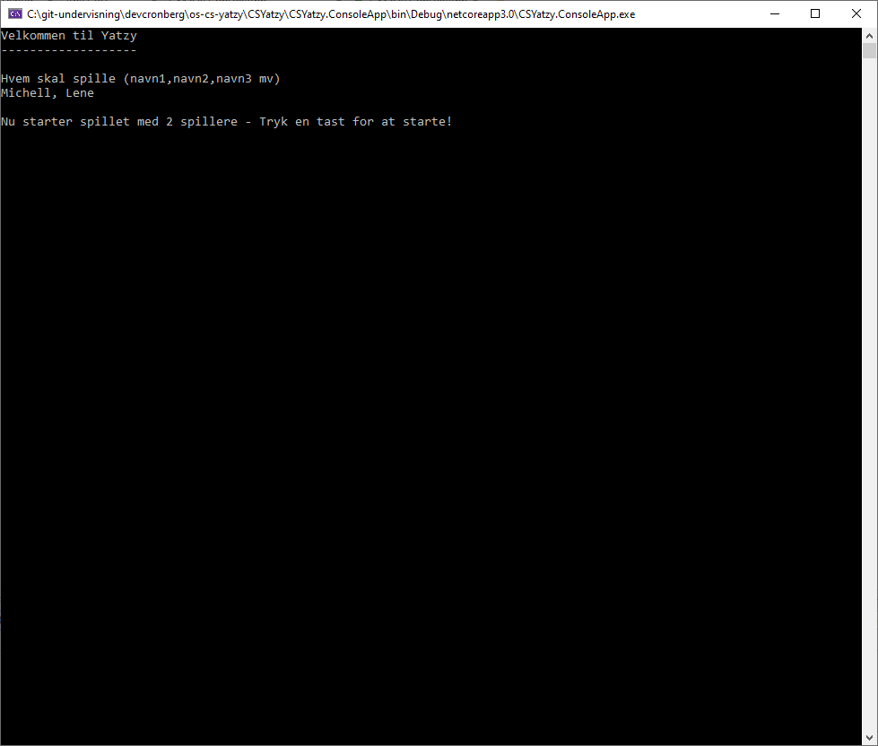
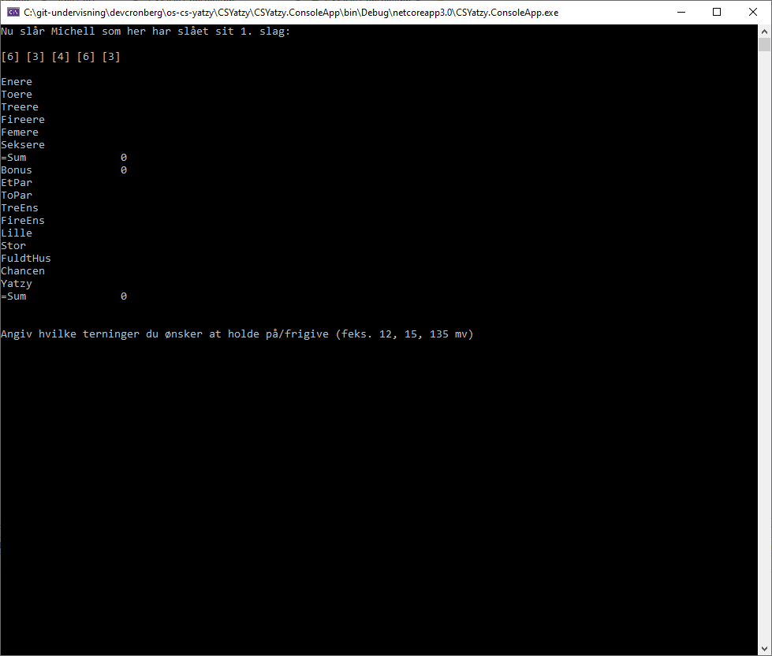
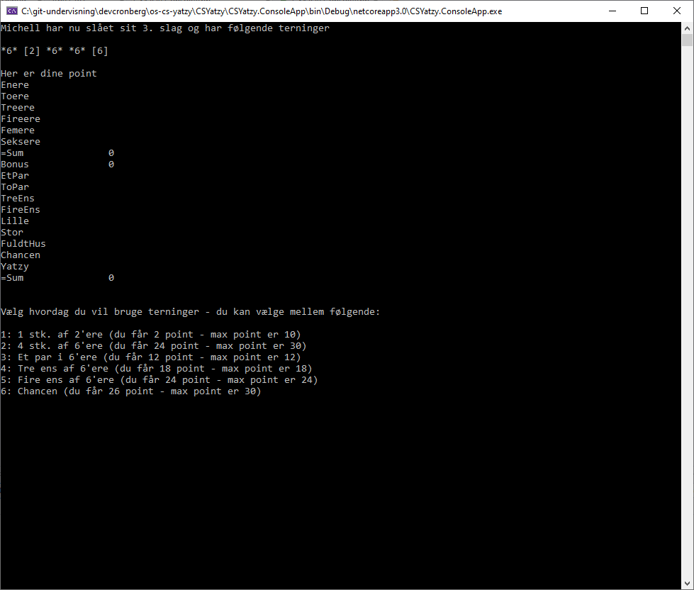

# Udvidet C#-opgave

Dette er en lidt omfattende opgave i både objektorienteret design og C# udvikling. Du skal skabe et Yatzy-spil hvor en eller flere spillere kan spille mod sig selv eller hinanden. Som ekstraopgave kan du eventuelt skabe en "Yatzy-bot", som kan simulere en eller flere modspillere. Som brugerflade kan du som udgangspunkt benytte en Console-applikation, men det skal være nemt at flytte brugerfladen til en Windows, Linux, Mac, Mobil, Web eller Service-brugerflade.

Opgaven er helt fri, og det er op til dig hvordan du løser den, men den skal ende i noget der minder den 
app du kan finde i dette respository. Jeg vil derfor anbefale dig at hente applikationen, og køre den 
gennem Visual Studio for at spille et enkelt spil mod dig selv. Du kan eventuelt også finde den 
sidste release [her](https://github.com/devcronberg/os-cs-yatzy/releases/latest), og hente csyatzy.zip. Herefter 
kan du afvikle app med ```dotnet csyatzy.consoleapp.dll``` eller afvikle spil_yatzy_win.bat (hvis du er på en Windows-platform).

Her er et par screenshorts af applikationen til orientering.






## Løsning

Du kan lade dig inspirere at koden i dette repository, hvor jeg har valgt at oprette en løsning med en "kerne" (.NET Standard klassebibliotek) og en "brugerflade" (.NET Core Console App). På den måde er jeg sikker på, at jeg kan benytte applikationer på Windows, Mac og Linux, og jeg kan uden problemer benytte kerne på andre platforme.

Jeg har valgt at oprette klasser som

- YatzyTerning
- YatzyBæger
- YatzyPoint
- YatzyPointType
- YatzyPointTavle
- YatzySpiller
- YatzySpil

og de er nogenlunde dokumenteret, så måske kan du få et par ideer til din egen løsning.

Held og lykke

/Michell

